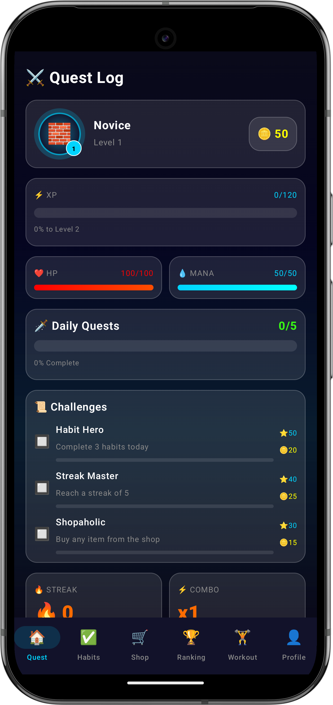
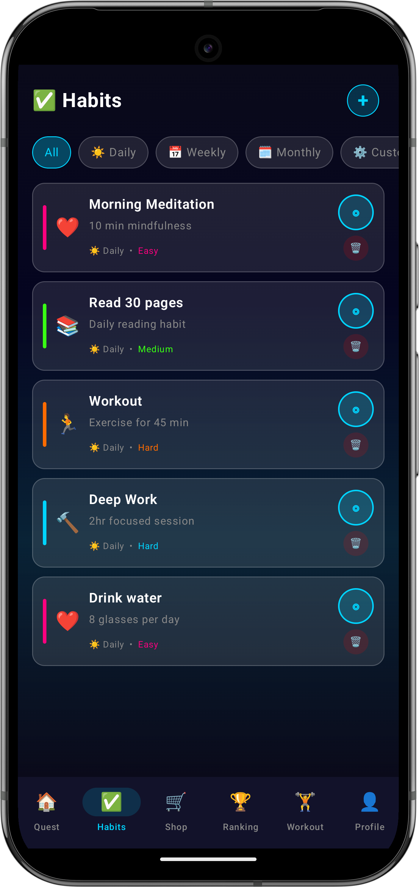
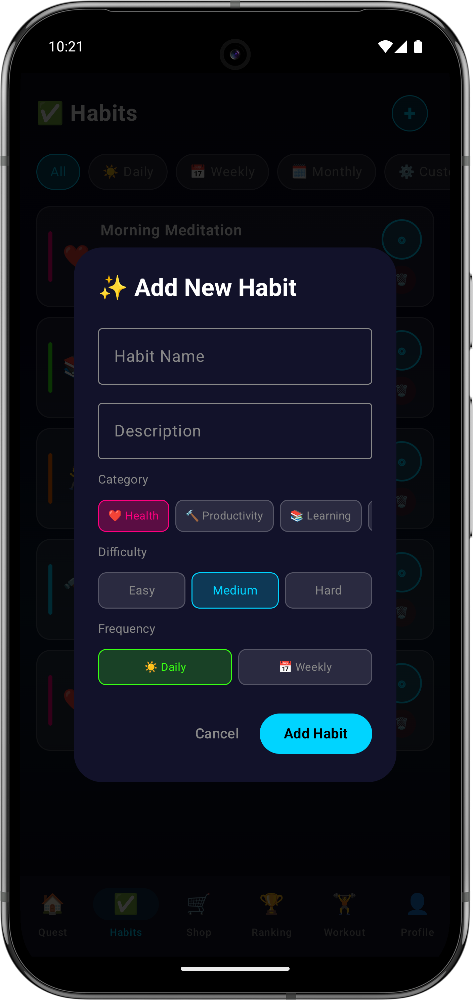
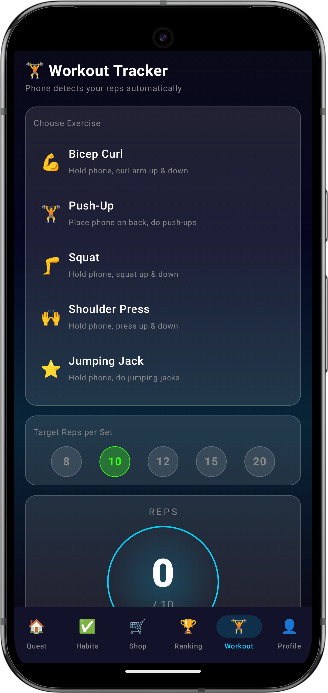
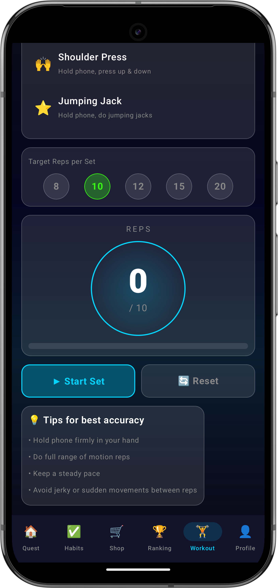
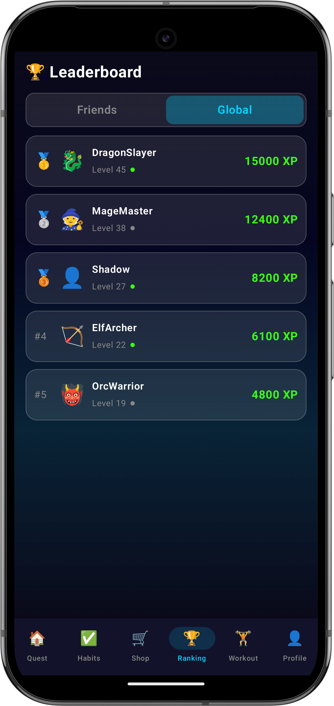
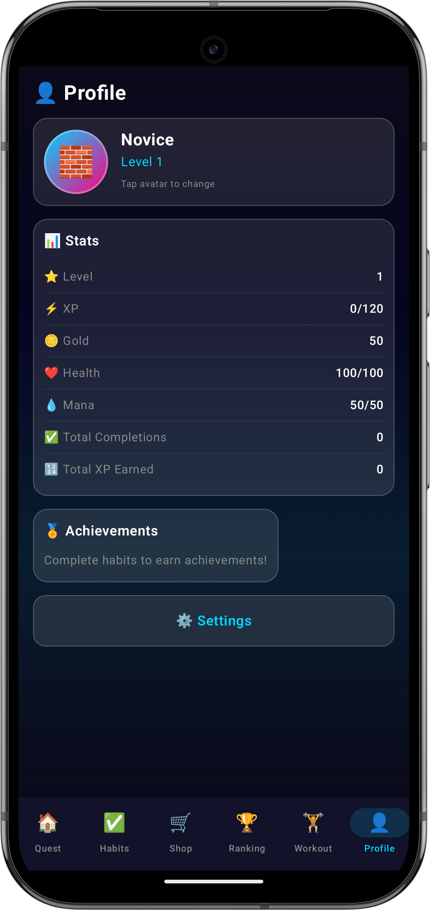
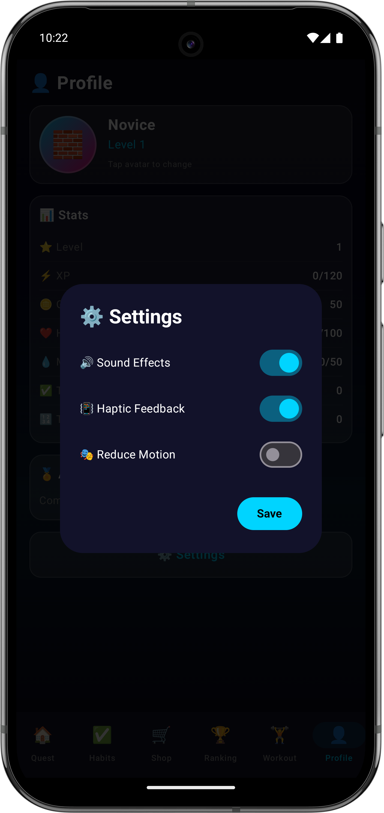

# HabitRPG Android

A gamified habit tracker built with Kotlin and Jetpack Compose.

## Features

- Habit Tracking
- XP & Leveling System
- Workout Tracking
- Notifications
- Leaderboards
- **Gyro-Gamified Interactions**

## Screenshots

<table>
  <tr>
    <td align="center">
       
      <b>Home Screen</b>
    </td>
    <td align="center">
       
      <b>Habits Main</b>
    </td>
    <td align="center">
       
      <b>Add Habit</b>
    </td>
  </tr>
  <tr>
    <td align="center">
       
      <b>Workout Tracker</b>
    </td>
    <td align="center">
       
      <b>Workout Progress</b>
    </td>
    <td align="center">
       
      <b>Leaderboard</b>
    </td>
  </tr>
  <tr>
    <td align="center">
       
      <b>User Profile</b>
    </td>
    <td align="center">
       
      <b>Settings</b>
    </td>
    <td></td>
  </tr>
</table>

## Advanced Features

### Gyro-Gamification
The app utilizes the device's **Gyroscope sensor** to create an immersive experience:
- **Interactive UI:** Navigate through menus by tilting your device.
- **Workout Tracking:** Detect movement patterns to assist in counting repetitions.
- **Responsive Feedback:** UI elements react in real-time to device orientation.